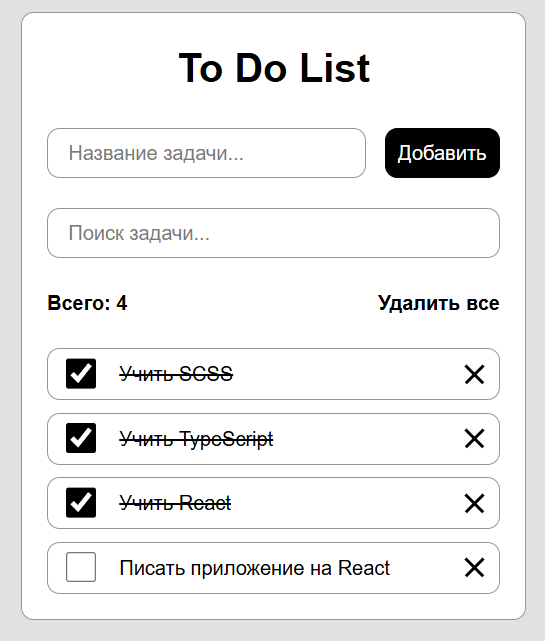

# 📋 React To-Do List

Простое и элегантное приложение для управления задачами, созданное на современном стеке React + TypeScript.



## ✨ Особенности

- ✅ **Создание задач** – быстрое добавление новых задач через интуитивный интерфейс
- 🔍 **Поиск задач** – мгновенный поиск по названию задачи
- 📊 **Счетчик задач** – отображение общего количества задач
- 🎨 **Современный дизайн** – чистый и минималистичный интерфейс
- 📱 **Адаптивность** – корректное отображение на мобильных устройствах

## 🛠️ Технологии

- **React 18** – библиотека для построения пользовательских интерфейсов
- **TypeScript** – статическая типизация для надежности кода
- **Vite** – современный сборщик для быстрой разработки
- **SCSS** – препроцессор для удобной стилизации
- **CSS Modules** – изоляция стилей компонентов

## 🚀 Быстрый старт

### Предварительные требования

- Node.js 16 или выше
- npm или yarn

### Установка

```bash
# Клонирование репозитория
git clone git@github.com:AlexandrFaleev/todo-react-ts.git

# Переход в директорию проекта
cd todo-react-ts

# Установка зависимостей
npm install
# или
yarn install